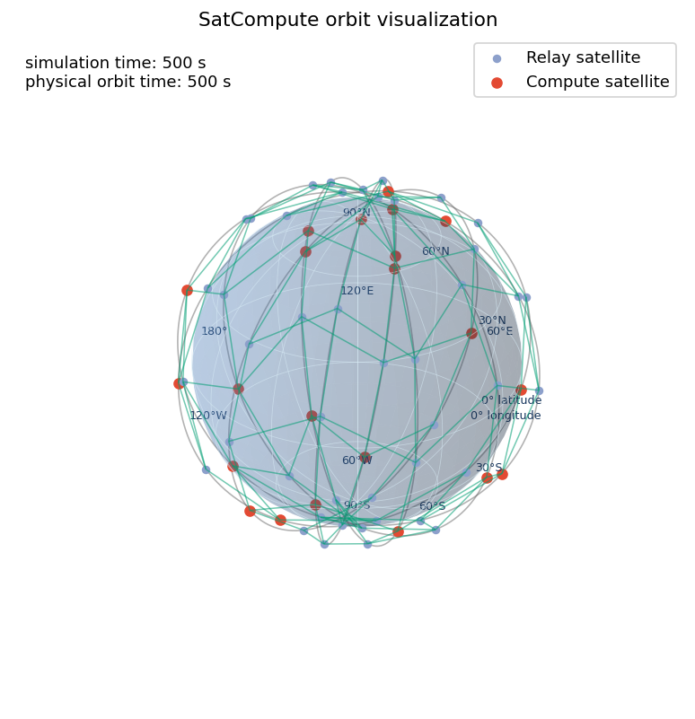
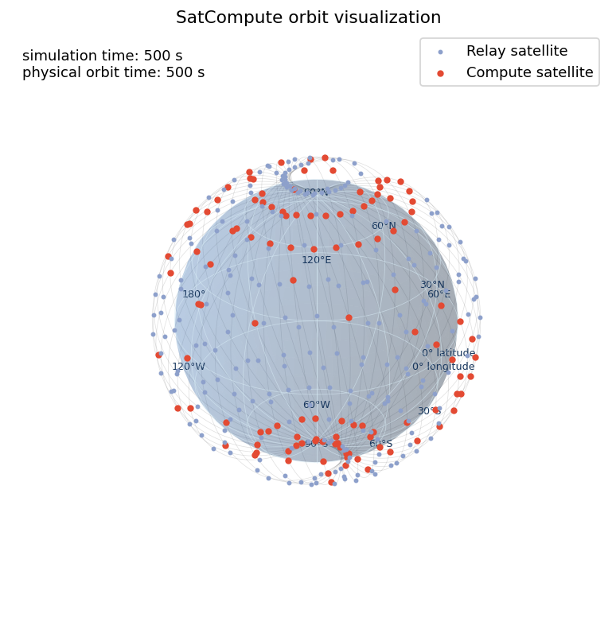

# 可选轨道可视化

本目录提供纯展示、默认关闭的 SatCompute 三维轨道查看器。它读取已经通过
checker 的 unified scenario，展示带经纬网和经纬度标记的 WGS72 地球、
Hypatia 传播得到的当前卫星位置、瞬时轨道面参考环、计算/普通卫星分类和可选
活动 ISL。它不改变 scenario、topology、路由或任务语义，也不实现故障、主备、
迁移、checkpoint、恢复路径、路由高亮、MP4 或论文逻辑图。

## 示例画面

两张截图均来自已提交的原始 1000 秒场景配置，取 `t=500 s`，未修改星座或
计算节点配置。点击图片可查看原始尺寸。

| 66 星 / 22 计算星 | 351 星 / 117 计算星 |
| :---: | :---: |
| [](docs/orbit-66-isl.png) | [](docs/orbit-351.png) |
| `detailed`；显示 121 条活动 ISL | `simplified`；为避免遮挡而隐藏 ISL |

## 依赖与直接入口

Matplotlib 和 Pillow 位于独立的 `visualization` dependency group。普通
`uv sync`、拓扑生成和仿真不安装或导入它们。

提交的 `config/orbit-viewer.json` 使用 `enabled=false`。直接展示前复制到
仓库外或 `/tmp`，将 `enabled` 改为 `true`，然后运行：

```bash
uv run --locked --group visualization python -m \
  contrib.satcompute.tools.visualization.orbit.viewer \
  --scenario-dir /tmp/satcompute-scenario \
  --config /tmp/orbit-viewer.json
```

窗口支持播放、暂停、时间 Slider、关闭、鼠标三维旋转和缩放，并同时显示当前
simulation time 与 physical orbit time。地球经纬网承担地理方向参照，因此不再
显示外部 XYZ 坐标框、刻度和背景网格。动画直接覆盖 `0..duration_s`；不会按
topology snapshot 拆成多个文件，也不会一次性构造所有帧的坐标和 artist。

## 配置

配置是独立的闭世界 JSON，不写入 `scenario-config.json`，不参与 manifest 或
aggregate SHA。

| 字段 | 含义 |
| --- | --- |
| `schema_version` | 固定为 `0.1` |
| `enabled` | 总开关；`false` 时不读取 scenario，也不导入 Matplotlib/Pillow |
| `display_mode` | `auto`、`detailed` 或 `simplified` |
| `render_step_s` | 交互/Headless 的视觉采样间隔，必须大于 0 |
| `playback_interval_ms` | 相邻显示帧的墙钟间隔，必须为正整数 |
| `show_earth` | 是否显示带经纬网和稀疏数值标记的半透明 WGS72 地球 |
| `show_orbits` | 是否显示每帧从真实位置拟合的轨道面参考环 |
| `show_links` | 是否按当前 topology snapshot 显示活动 ISL |
| `show_node_labels` | detailed 模式下是否显示 node ID；simplified 强制关闭 |
| `detail_node_threshold` | `auto` 的规模阈值；示例为 100 |
| `export_gif` | 是否额外输出 GIF；默认 `false` |
| `gif_path` | GIF 路径；启用时必须是 scenario 目录外的非空 `.gif` 路径 |
| `gif_frame_step_s` | GIF 独立抽帧间隔，必须大于 0 |

`auto` 在 `node_count <= detail_node_threshold` 时选择 detailed，否则选择
simplified。因此默认阈值下 66 星为 detailed，351/720 星为 simplified。
detailed 使用较大的节点、较清晰的轨道环和可选标签；simplified 强制关闭标签，
并使用更小节点、更细更透明的轨道环和 ISL。用户仍可在 simplified 中显式设置
`show_links=true`。

## 数据与时间语义

- 卫星位置来自现有 `OrbitConstellation.positions_at()` 和 `HypatiaAdapter`，不从
  绘图圆环反推或伪造。
- 地球经纬网固定为 30° 间隔，并在不遮满画面的前提下标记主要纬度和经度。
  它与卫星使用同一 Earth-fixed 坐标系：0° 经线指向 +X，90°E 指向 +Y，
  北极指向 +Z。`show_earth=false` 时地球、经纬网和标记一起关闭。
- dynamic scenario 使用
  `physical_time_s = orbit_sample_offset_s + simulation_time_s`；static scenario
  在唯一显示帧使用 `snapshot_time_s`。
- 计算节点严格读取 `resources/compute-profile.json`；其余有效 node ID 才归为
  普通卫星，不按编号间隔猜测。
- `show_links=true` 时，从 `topology_<time>s.json` 读取活动 ISL，并在两个快照
  之间采用 last-snapshot-held。卫星位置仍按每个 `render_step_s` 重新传播。
- 轨道环每帧使用同一轨道面内两个非共线位置向量拟合，节点和圆环始终处于同一
  Earth-fixed 千米坐标系。

`render_step_s` 只控制画面采样，不等于 topology 的 `step_s`，也不会改变仿真
快照或路由重算频率。

## 生成场景后的可选展示

统一场景生成器支持：

```bash
uv run --locked --group visualization python -m \
  contrib.satcompute.tools.generation.scenario.generate_scenario \
  --config contrib/satcompute/tools/generation/scenario/config/synthetic-66-compute-22.json \
  --output-dir /tmp/satcompute-scenario \
  --visualization-config /tmp/orbit-viewer.json
```

不提供参数时完全不进入可视化路径；配置关闭时跳过。配置启用时，只在 scenario
通过 checker 并完成原子发布后启动 viewer。展示失败会报告错误，但不会回滚已经
成功发布的 scenario。

## GIF 与 Headless

GIF 使用 PillowWriter，不依赖 FFmpeg，不输出 MP4。GIF 必须位于 scenario
目录之外，不写 manifest、不参与哈希，也不得提交到仓库。

无显示服务器时使用 Agg：

```bash
MPLBACKEND=Agg MPLCONFIGDIR=/tmp/satcompute-matplotlib \
uv run --locked --group visualization python -m \
  contrib.satcompute.tools.visualization.orbit.viewer \
  --scenario-dir /tmp/satcompute-scenario \
  --config /tmp/orbit-viewer.json \
  --headless
```

`--headless` 仍渲染配置指定的完整时间序列，但不会调用 `plt.show()`。CI 的短
smoke 生成 66 星 20 秒场景并渲染 t=0、10、20；GIF smoke 最多写 3 帧，所有
产物只位于 `/tmp`。
