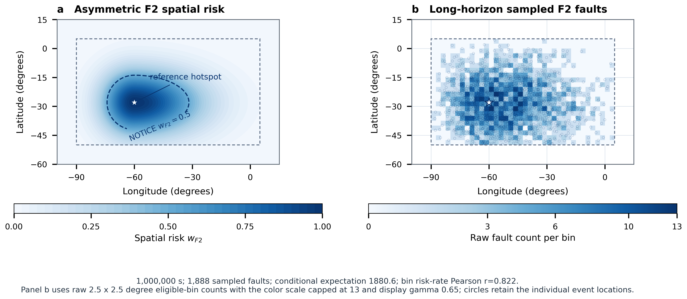

# N4B F2 空间辐射风险标定

本目录记录修订后的 F2 空间风险模型。当前已经完成东西向非对称风险场、参数扫描、
66 星强度反标定、351/720 星规模外推，以及 66 星 100 万秒空间验证与论文候选图。

旧的对称经度模型证据没有删除，统一归档在
[`evidence/historical-symmetric/`](evidence/historical-symmetric/)；其中的 50 万秒、
963 次故障和旧 PNG 只用于历史对照，不是当前非对称模型的验收结果。

## 模型

F2 使用 ns-3.48 原生圆轨道的实时 ECEF 坐标，经官方地理坐标转换后判断 SAA：

```text
-90 deg <= longitude <= 5 deg
-50 deg <= latitude  <= 5 deg
```

SAA 外令 `w_F2=0`。SAA 内以 `(-60 deg,-28 deg)` 为热点中心，采用东西向尺度不同的
two-piece Gaussian 工程近似：

```text
delta_lon = longitude - hotspot_longitude
sigma_side = sigma_west, delta_lon < 0
             sigma_east, delta_lon >= 0

w_F2(t) = exp(-0.5 * (delta_lon / sigma_side)^2
              -0.5 * (delta_lat / sigma_lat)^2)
lambda_SEU(t) = lambda_SEU_max * w_F2(t)
lambda_F2(t) = rho_SF * lambda_SEU(t)
q_F2(t) = 1 - exp(-lambda_F2(t) * dt)
```

`w_F2 >= theta_F2` 只负责开启 NOTICE；`0 < w_F2 < theta_F2` 时仍允许发生未预警
故障。连续暴露时间只用于 episode 统计，不参与当前故障强度、单步概率、NOTICE 或
随机采样。`rho_SF` 是场景级 SEU 到计算服务故障映射系数，不解释为实测条件概率。

## 空间形状选择

66 星从轨道 epoch 0 扫描 7200 秒，每秒查询一次位置。纬度尺度固定为 `12 deg`，
比较三个满足 west < east 的最小候选：

| `sigma_west/east` | 总加权暴露 | 高风险 satellite-seconds | 高风险 episode | 完整 dwell 中位数 | 选定窗口加权暴露 |
|---:|---:|---:|---:|---:|---:|
| 12/18 deg | 7998.1761 | 5795 | 17 | 392.0s | 1164.1045 |
| **12/24 deg** | **9558.7763** | **6966** | **20** | **409.0s** | **1398.9946** |
| 18/24 deg | 10768.2504 | 8123 | 23 | 402.5s | 1540.4906 |

最终选择 `12/24 deg`：它在候选中形成最明确的西短东长结构，同时保留 20 个可观察
高风险 episode，高风险区域没有覆盖整个 SAA，也没有缩小到典型轨道难以穿越。

冻结形状参数为：

```text
sigma_west = 12 deg
sigma_east = 24 deg
sigma_lat = 12 deg
theta_F2 = 0.5
rho_SF = 0.5
```

在 `theta_F2=0.5` 下，NOTICE 等风险线相对热点约向西延伸 `14.13 deg`、向东延伸
`28.26 deg`，南北各延伸 `14.13 deg`。低于 NOTICE 阈值的风险尾部仍可存在于 SAA
矩形内，这不等于 active high-risk region 越界。

阈值扫描结果为：

| `theta_F2` | 高风险 satellite-seconds | episode 数 | 完整 dwell 中位数 |
|---:|---:|---:|---:|
| 0.4 | 9215 | 23 | 458.0s |
| **0.5** | **6966** | **20** | **409.0s** |
| 0.6 | 5180 | 17 | 330.0s |

## 66 星强度与规模外推

非对称模型下，满足 episode 覆盖约束且空间加权暴露最大的 1000 秒窗口从轨道 epoch
`302s` 开始：

```text
A_F2^w = 1398.9946280633549 satellite-seconds
target E[K_F2] = 2
kappa_F2 = 2 / A_F2^w
          = 0.0014295980555469494 s^-1
rho_SF = 0.5
lambda_SEU_max = kappa_F2 / rho_SF
               = 0.002859196111093899 s^-1
```

这里的目标是多个随机 run 的平均值约为 2，不要求每个 run 恰好发生两次。冻结 66 星
参数后，351/720 星不再分别调参：

| 星座 | `orbitStartOffset` | 选定窗口加权暴露量 | 固定参数下的解析期望故障数 |
|---|---:|---:|---:|
| 66 星 | 302s | 1398.9946 | 2.0000 |
| 351 星 | 4704s | 7150.5901 | 10.2225 |
| 720 星 | 3478s | 14463.6294 | 20.6772 |

100 个固定 `randomRun=1..100` 的真实 66 星平台运行得到平均 1.91 次故障，最小 0、
最大 6，近似 95% 均值区间为 `[1.6561,2.1639]`，包含解析目标 2。11 个 run 没有
发生 F2 故障也属于随机过程的正常结果。

## 复现阶段一标定

66 星冻结空间参数、窗口和强度：

```bash
./ns3 run "satcompute-f2-exposure-calibration \
  --constellationConfig=contrib/satcompute/input/topology/constellations/synthetic-66.csv \
  --calibrationDuration=7200 \
  --windowDuration=1000 \
  --targetMeanFaultCount=2 \
  --outputDir=/tmp/satcompute-f2-66"
```

351/720 星复用 66 星有效热点强度，只计算规模外推：

```bash
./ns3 run "satcompute-f2-exposure-calibration \
  --constellationConfig=contrib/satcompute/input/topology/constellations/synthetic-351.csv \
  --calibrationDuration=7200 \
  --windowDuration=1000 \
  --referenceMaximumFailureIntensity=0.0014295980555469494 \
  --outputDir=/tmp/satcompute-f2-351"

./ns3 run "satcompute-f2-exposure-calibration \
  --constellationConfig=contrib/satcompute/input/topology/constellations/synthetic-720.csv \
  --calibrationDuration=7200 \
  --windowDuration=1000 \
  --referenceMaximumFailureIntensity=0.0014295980555469494 \
  --outputDir=/tmp/satcompute-f2-720"
```

真实平台 Monte Carlo：

```bash
python3 contrib/satcompute/tools/validation/run-f2-monte-carlo.py \
  --run-count=100 \
  --calibration-summary=/tmp/satcompute-f2-66/n4b-f2-spatial-calibration-summary.json \
  --outputDir=/tmp/satcompute-f2-monte-carlo
```

这些标定输出不是平台输入。正式 generate 仍从实时轨道位置计算 `w_F2`；replay 仍只
执行冻结的 Fault Trace，不读取或重新计算空间风险。

## 100 万秒空间验证

最终空间证据使用：

```text
constellation = 66 satellites
duration = 1000000 s
orbitStartOffset = 302 s
randomSeed/randomRun = 1/1
position and F2 check interval = 1 s
recoverable compute outage = 8 s
grid = 2.5 deg x 2.5 deg
```

该运行只包含原生轨道位置和 F2 抽样，不创建网络、路由、任务、F1、F3 或
`FaultController`。共执行 6600 万次原生位置查询，本机运行耗时 160.97 秒，峰值
常驻内存 18840 KiB。正式结果为：

| 指标 | 结果 |
|---|---:|
| SAA 内总暴露 | 5,331,826 satellite-seconds |
| 可抽样 SAA 暴露 | 5,318,612 satellite-seconds |
| 可抽样加权暴露 | 1,315,957.7695 weighted satellite-seconds |
| 未计恢复抑制的逐步期望故障数 | 1,890.3900 |
| 按本次实际恢复区间计算的条件期望 | 1,880.5918 |
| 实际 F2 故障数 | 1,888 |
| 实际计数相对条件期望的标准分数 | 0.1709 |
| NOTICE 高风险区内故障 | 983（52.07%） |
| NOTICE 阈值外故障 | 905（47.93%） |
| 高风险区占可抽样 SAA 暴露 | 17.92% |
| 暴露加权平均风险 | 0.2474 |
| 故障位置平均风险 | 0.5190 |
| 风险—故障率 Pearson 相关系数 | 0.8224（699 个有效网格） |
| 原始最高故障数网格 | 13 次，中心 `(-58.75 deg,-31.25 deg)` |

实际故障数只比条件期望多 7.41 次，位于 0.171 个标准差内。只占 17.92% 暴露的
NOTICE 区域承载了 52.07% 的故障；故障位置平均风险约为一般暴露风险的 2.10 倍，
风险—故障率相关系数达到 0.8224。事件数、计数偏差、风险集中性、高风险区富集和
正相关五项自动验收全部通过。



论文候选图同时提供[可编辑 SVG](n4b-f2-spatial-validation.svg)和
[PDF](n4b-f2-spatial-validation.pdf)。图中不使用地球底图，而以 SAA 矩形四周各
10 度的固定边距显示故障域；当前参数对应经度 `[-100,15]`、纬度 `[-60,15]`，
SAA 矩形外的理论风险严格为 0。该视窗裁剪只改变论文图的呈现范围，不平移、缩放
或删除任何卫星坐标与故障事件，完整原始坐标继续保存在证据 CSV 中。左图显示非对称
理论风险场，右图直接显示满足最低暴露要求的每个 2.5 度网格的原始整数故障数，并
叠加全部 1888 个原始故障位置。右图色标固定从 0 到原始网格的最大故障数 13，
不再使用“每百万 exposure”的刻度。

论文图使用同一组蓝色梯度，低值到高值依次为 `#F4F9FE`、`#D2E3F3`、`#AACFE5`、
`#68ACD5`、`#3888C0`、`#105CA4`、`#08336E`。右图不再进行 3 x 3 邻域平滑、
插值或空洞填补；为增强低计数网格的颜色区分度，只对色彩映射使用 `gamma=0.65` 的
幂归一化。该归一化不修改原始整数计数，色标仍直接标注 0--13 的故障次数。原始事件、
整数网格和曝光归一化故障率继续保存为可审计证据。

复现正式运行和绘图：

```bash
./ns3 run "satcompute-f2-spatial-validation \
  --constellationConfig=contrib/satcompute/input/topology/constellations/synthetic-66.csv \
  --duration=1000000 \
  --orbitStartOffset=302 \
  --longitudeBin=2.5 \
  --latitudeBin=2.5 \
  --randomSeed=1 \
  --randomRun=1 \
  --outputDir=/tmp/satcompute-f2-spatial"

uv run contrib/satcompute/tools/validation/plot-f2-spatial-validation.py \
  --summary=/tmp/satcompute-f2-spatial/n4b-f2-spatial-validation-summary.json \
  --bins=/tmp/satcompute-f2-spatial/n4b-f2-spatial-validation-bins.csv \
  --events=/tmp/satcompute-f2-spatial/n4b-f2-spatial-fault-events.csv \
  --output=/tmp/satcompute-f2-spatial/n4b-f2-spatial-validation.png
```

仓库保留 PNG/SVG/PDF，以及原始[事件 CSV](evidence/n4b-f2-spatial-fault-events.csv)、
[原始网格 CSV](evidence/n4b-f2-spatial-validation-bins.csv)和
[验收 summary](evidence/n4b-f2-spatial-validation-summary.json)。它们都是可复现实验
证据，不是平台输入；正常运行不会生成或读取这些文件。

### 图像 QA 与统计边界

- 图宽 7.2 英寸，PNG 以 600 dpi 导出为 4118 x 1795 像素；SVG 保留可编辑文字，
  PDF 嵌入 TrueType 子集字体；
- 本图的样本定义为 66 颗卫星、一个固定 seed/run 和 100 万个一秒检查点，共
  6600 万次位置观测；1888 是事件数，不是独立卫星样本数；
- 图中 Pearson `r` 是空间一致性的描述性指标，不是跨随机 run 的置信区间或显著性
  检验；故障总量的随机波动依据仍是前述 100-run Monte Carlo；
- 图像没有地球底图、局部手工修补、网格平滑、插值或事件抽样。固定经纬度视窗仅
  用于放大展示，`gamma=0.65` 仅控制颜色映射；全部 1888 个事件位置仍以圆圈叠加
  并保留在源 CSV 中。
