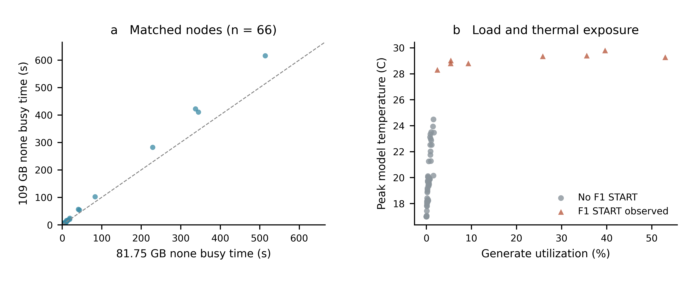
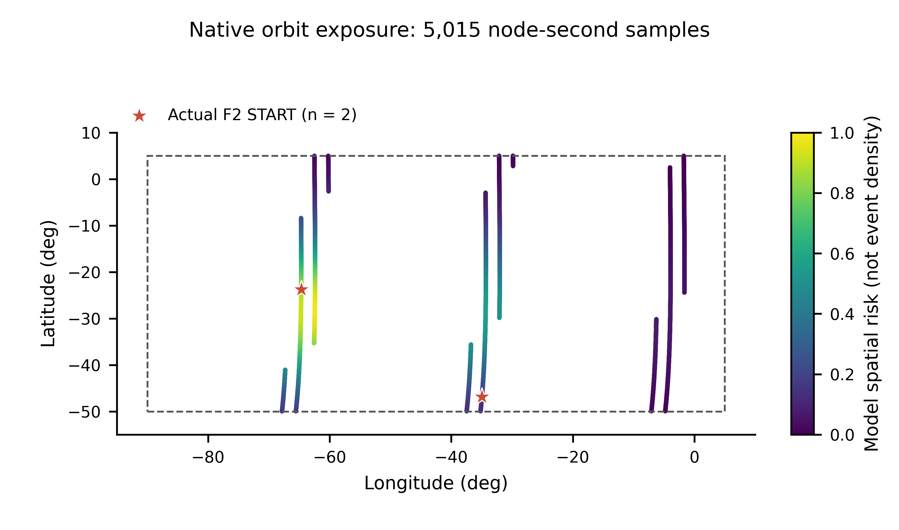

# N4C G3：F1 升温形状、热点标定与大任务 F3

状态：v3 修订与验证已完成；109GB派生压力修订进行中，仍属于G3。
下列81.75GB结果保留为历史基线，不覆盖G1或旧输入/输出。
历史v3功能核验通过，**数量标定未达标**。
F1∪F2 direct标定均值48.33、独立验证均值51，均低于75–83；不进入G4/N5。
本轮不跑CI、不合并、不打标签。
当前只更新本报告和既有两张图；批量原始结果在 `output/n4c-g3-v3-20260909`。
旧 beta=3、validation 21/22/23 保留在 Git 历史和
`output/n4c-g3-revision-20260909`，不再作为本轮正式或 held-out 证据。

## 冻结业务与模型边界

- 66 星全部 100,000 WU/s，1000 s，orbitStartOffset=0；10 Gbps、fixed 8 ms，
  capacity-aware HRW、size-aware，20 s 网络更新、1 s 指标/故障检查。
- C800 dense/sparse/compression/LLM=240/240/240/80；INPUT=81,750,000,000 B，
  RESULT=44,076,569,084 B，WU=183,958,466。逐任务类别、字节、WU、到达时刻不改，只改端点。
  compute deadline 在首次 RUNNING 时建立，factor=1.3；INPUT/首次排队/RESULT 不占该时限。
- F2 不变：referenceSeuIntensityPerSecond=0.002859196111093899、rho_SF=0.5；
  SAA 经度 [-90,5]、纬度 [-50,5]、中心 (-60,-28)，东西/纬度尺度 12/24/12 度。
- F1/F2 中断 RUNNING，QUEUED 保留，INPUT/新到达继续，RESULT 不受 compute-only fault 影响；
  恢复后按 FCFS 继续，不复活失败任务。F3 永久断星并立即重算路由。
  不恢复 NOTICE/NOTICE_CLEAR/RiskEpisode；QueryComputeRisk、START 概率及任务影响账本保留。

F1 基础/风险/临界/热平衡温度保持 17/20/30/35°C，冻结 **beta=10、gamma=1.5**：

```text
dT/dt = k_h * (35-T)^gamma                            # busy，闭式按实际 elapsed 推进
k_h = (5^(1-gamma)-18^(1-gamma)) / ((gamma-1)*30)      # gamma > 1
k_h = ln(18/5)/30                                    # gamma = 1，仅兼容参考
T_next = max(17, T - 3.25*dt)                         # 所有 non-busy
pT = 0 / expm1(beta*(T-20)/10)/expm1(beta) / 1         # T<=20 / 20<T<30 / T>=30
pF1_1s = min(1, pT*(1+0.1*energyPressure))
q_comp = 1-(1-pF1)*(1-pF2)
```

k_h 自动保证 17→30°C 恰好 30 s，不独立调参；gamma=1.5 时为 0.014100755673629473。
从当前温度推进，不从任务年龄重新升温；非整数 elapsed 和同刻 FCFS 衔接不制造冷却间隙。
pF1 是当前参考 1 s 的**条件概率**，不是历史累计首次故障概率；其他检查步长用
`1-(1-pF1_1s)^dt` 换算。临界过冲钳位到30°C，F1 恢复时长 (T_start-17)/3.25 向上取整到 ns，
在 (0,4] s 内；真实线性冷却至17°C，不在恢复时 reset。F2 恢复仍为8 s。
同刻 F1/F2 分别抽样、来源都保留，只形成一次停机且时长取 max；停机内不抽新故障。
公式、参数和 API 详见 [fault README](../../../contrib/satcompute/fault/README.md)。

## 四组 pilot：先冻结形状，不按故障数选择

固定 seed=1、run=11、原 w64 TaskTrace、F3 off；全部从干净提交 `5af0d0cef` 启动，
墙钟492–501 s。原输入保留是为了四组比较时不改变 placement。

| beta/gamma | F1 START | F1∪F2 direct | F2 START/direct | 温度22–25°C / 29.9–30°C次数 | 匹配概率行 |
|---|---:|---:|---:|---:|---:|
| 8/1.5 | 42 | 42 | 2/0 | 4/0 | 1753 |
| 8/2 | 53 | 51 | 2/0 | 6/0 | 1753 |
| 10/1.5 | 36 | 35 | 2/0 | 0/0 | 1777 |
| 10/2 | 43 | 43 | 2/0 | 1/0 | 1758 |

下表每格依次为 **min/P10/P50/P90/max**；pF1 已转为百分数，分位数线性插值。

| beta/gamma | START 温度 °C | 当前步 pF1 % |
|---|---|---|
| 8/1.5 | 23.438/25.174/27.397/28.434/29.293 | 0.492/2.075/12.472/28.558/56.770 |
| 8/2 | 23.229/24.888/27.802/28.637/29.555 | 0.411/1.715/17.210/33.589/70.041 |
| 10/1.5 | 25.323/26.502/28.255/29.177/29.563 | 0.926/3.089/17.469/43.935/64.606 |
| 10/2 | 23.538/26.402/28.109/28.882/29.540 | 0.152/2.733/15.093/32.796/63.101 |

| beta/gamma | continuous busy s：min/P10/P50/P90/max | 动态恢复 s：min/P10/P50/P90/max |
|---|---|---|
| 8/1.5 | 8.282/11.463/17.324/21.585/25.939 | 1.981/2.515/3.199/3.518/3.782 |
| 8/2 | 0/8.129/16.419/21.057/26.606 | 1.917/2.427/3.324/3.581/3.863 |
| 10/1.5 | 0/13.892/20.982/25.253/27.398 | 2.561/2.924/3.463/3.747/3.866 |
| 10/2 | 6.582/11.956/18.409/21.557/25.939 | 2.012/2.893/3.418/3.656/3.858 |

选择10/1.5：没有22–25°C START，pF1 中位/P90最高，没有临界堆积，gamma也较2温和。
不按 direct 数选，35最少也不回调。**仍未完全达到建议的 pF1 中位20–30%、
P90约50%**，不能宣称全部形状目标达标。这些是场景目标，不是航天器实测概率。
busy=0 可对应刚转 idle 后余热，不能伪造 RUNNING victim。所选组同节点 START 间隔
min/P10/P50/P90/max=16/20.8/27/65.9/176 s。
四组共7041行四项概率全部匹配、479个实际停机冷却点通过。

## 热点筛选和预声明停止规则

曲线冻结后仅按64→96→128、regional limit=1筛选，F3 off、seed1/run11。
新版纯 placement 不预留 F3 节点，manifest 的 f3=null；因此重跑w64，不能直接沿用pilot数量。
无故障与筛选使用同一输入，每任务业务与到达保持不变。

| 权重 | 热候选任务占比 | F1/F2 START | F1∪F2 direct | none完成 | none最忙节点busy s | none排队mean/P95/max s |
|---|---:|---:|---:|---:|---:|---|
| 64 | 72.875% | 40/2 | 38 | 800/800 | 414.924 | 4.822/19.659/36.630 |
| 96 | 81.750% | 46/2 | 45 | 800/800 | 446.531 | 6.048/22.284/30.346 |
| 128 | 86.625% | 47/2 | 47 | 800/800 | 514.054 | 13.805/43.736/57.076 |

64、96明显不足，只作screen，不作为正式三轮标定。达到最后候选128后不再扩搜。
正式数量判断必须在重新构造大任务F3、final none验收后，跑calibration 11/12/13，
按不同 RUNNING direct victim 的均值判断75–83；低于75才允许进入下一预声明权重，
超过83停止增加集中度。到128仍不足也如实报告，不继续160/192或回调beta/gamma。
只有达标才称“达到压力目标的最小权重”，不能把搜索上限当作达标。

## 大任务 F3、final none 与正式运行

128仍不足，停止扩大搜索，以此上限候选完成后续正式标定并如实报告差距。
大任务F3由candidate none唯一合法候选确定：node41/task191、1GB/1,500,000WU；
none计算536.690531627→551.690531627 s，F3=547.190531627 s，对应70% WU进度。
普通task22于471.945437896 s实际使用源端node41，472.065216011 s完成INPUT并脱离。
F3只从none真实业务时序选：
INPUT>200MB、WU进度>50%，优先60–80%，固定hash/task ID打破平局；
不读概率/温度/空间风险，移除旧北侧/SAA规避规则。
检查队列、INPUT、RESULT及已到达尚未开始的RESULT依赖。F3前至少一个非victim普通任务
实际使用并脱离该节点；前缀端点与candidate none逐项相同，F3后新任务排除失效星。
正式run若目标提前被F1/F2中断、进度不足或出现额外victim，保留该run并记F3验收失败，
不换seed/目标/时刻、不屏蔽故障。F3计划只供离线构造和调度，在线算法不读取未来故障。

全部模型、输入、F3、final none、calibration冻结后，才首次运行
**held-out validation 31/32/33**；不根据验证结果反向调整参数。
代表图预声明取calibration run11，不选择最漂亮的一轮。

最终输入冻结在干净提交 **a6e034bafb1e269e6e4c6b8b7c6ebdb34a9d8687**；final none、
三轮calibration、audit-off重复及三轮validation均从此提交启动，模型/输入不再变化。
final none用时450.38 s：800/800任务、1600/1600传输完成，零deadline/endpoint失败、
零丢包/队列丢弃/截断，capacity与末端链路账本清零；最终热点占比87.25%，最忙节点
busy=514.05444 s（51.4054%）；排队mean/P95/max=13.7793/43.7357/57.0765 s，
最后任务606.335354 s完成。平均可用链路利用率0.200277%，有效传输窗口聚合IP吞吐量
1664.845408 Mbps。final none确认上述F3计算窗口及70% WU进度，没有额外端点依赖。

## 正式标定与独立验证

| 组/run | F1/F2 START | F1∪F2 direct | F3 direct | 完成/失败 | 匹配概率行 |
|---|---:|---:|---:|---:|---:|
| calibration 11 | 47/2 | 47 | 1 | 752/48 | 1711 |
| calibration 12 | 53/1 | 53 | 1 | 746/54 | 1736 |
| calibration 13 | 45/0 | 45 | 1 | 754/46 | 1705 |
| validation 31 | 49/0 | 49 | 1 | 750/50 | 1710 |
| validation 32 | 51/3 | 51 | 1 | 748/52 | 1751 |
| validation 33 | 53/3 | 53 | 1 | 746/54 | 1716 |

标定F1∪F2 direct均值 **48.33**、样本标准差 **4.16**、范围45–53，未达到75–83。
权重128只是预声明搜索上限，不是达标候选；停止扩搜，不回调beta/gamma。
31/32/33在上述标定结果确认后首次启动，验证均值 **51**、样本标准差 **2**、范围49–53，
仍低于目标，不用于继续调参。标定与验证分别较参考79少38.82%/35.44%。
六轮F2 direct均为0，没有同刻双来源（边界由确定性测试覆盖）。
六轮F3均恰好一个事件、一个RUNNING victim：compression task191，源57/计算41/结果31，
INPUT=1GB、WU=1,500,000，真实开始536.690531627 s；F3时已完成1,050,000WU（70%），
deadline余量9 s；普通task22事前源端参与时序均通过，无额外QUEUED/INPUT/RESULT victim，
整星立即永久不可用、恰好一次故障路由重算。
六轮均无额外deadline/network/endpoint失败、丢包、队列丢弃或任务截断，末端资源账本清零。

代表run11有50次START，但只有48个直接失败任务；1552个transfer完成、48个取消，
取消项均为失败任务未开始的RESULT，800个INPUT均完成。没有额外deadline/network/endpoint失败。
QUEUED_DELAYED为455行/351个不同任务；停机期到达60个任务、INPUT继续4个任务。
共376个任务出现在影响账本，直接和间接受影响集合会重叠，不能简单相加。
相同任务对比none的平均排队变化为-0.517468 s：失败任务剩余工作被丢弃，可能减轻后续
整体排队，不代表停机没有延误。代表轮平均可用链路利用率0.194681%。

## 代表轮：故障时概率、任务大小和WU完成度

均取预声明calibration11。前四行统计47次F1 START，间隔统计同节点42对相邻START；
任务行只统计47个实际RUNNING direct victim。分位数线性插值。

| 量 | min | P10 | P50 | P90 | max |
|---|---:|---:|---:|---:|---:|
| START温度 °C | 25.8338 | 26.9081 | 28.5595 | 29.1566 | 29.3546 |
| 当前步pF1 % | 1.5467 | 4.5395 | 23.6780 | 43.0283 | 52.4428 |
| continuous busy s | 1.5147 | 14.9415 | 22.3838 | 24.6501 | 26.2641 |
| 动态恢复 s | 2.7181 | 3.0486 | 3.5568 | 3.7405 | 3.8014 |
| 同节点START间隔 s | 17 | 20 | 26 | 30 | 132 |
| 直接victim完成度 % | 2.9180 | 11.2956 | 37.4927 | 83.9314 | 97.6438 |
| 直接victim INPUT B | 429 | 522.6 | 129,497,184 | 500,000,000 | 1,000,000,000 |
| 直接victim WU | 64,129 | 110,170.4 | 246,793 | 913,900 | 1,500,000 |
| deadline余量 s | 0.5037 | 0.8916 | 2.4571 | 10.2441 | 17.5092 |

F1 victim类别dense/sparse/compression/LLM=11/9/15/12，区域北美/欧洲/东亚=21/21/5。
22–25°C和29.9–30°C START均0次；温度和pF1中位符合建议，P90仍低于约50%，保留差距。
两次F2分别在263 s/node28、742 s/node17，pF2=0.0240649%/0.1243540%、pF1=0，
当时没有RUNNING任务，不能为它们编造任务大小或完成度。各轮逐条pF1/pF2/q_comp、任务
字节、WU进度、deadline余量和终态保留在fault-events.csv与fault-task-impact.csv。

## 实现与功能回归

- 已通过配置内模块/入口/工具编译、39个Python、15个C++、6个smoke及4个维护regression。
  无ns-3全局example/test、无CI。
- 新增gamma=1兼容、近1/1.5/2端点、前快后慢、非整数分段流、热平衡边界检查；
  保留概率周期换算、只读查询、恢复/FCFS、同刻双来源、F3抢占旧恢复等边界。
- 大任务F3生成器测试覆盖确定性、strict >200MB、WU进度、队列/未来RESULT、
  none前缀不变及故障后端点排除；不完整F3计划在仿真和输出创建前拒绝。
- F1/F2/联合小例概率行161/136/111全部一致；100任务联合回归88完成/12失败、
  483行概率匹配。回归不要求固定随机故障配额。
- 六轮正式运行 **10,329行** pF1/pF2/q_comp/P_fail_before_finish全部匹配，
  MAE/RMSE/max absolute error均为0，无缺失或上下文错配；**862个**实际停机冷却点通过。
- run11 audit on/off的18项正式业务证据相同（run-summary只排除墙钟时间）；关闭审计时
  四种可选概率/状态输出均不存在。正常运行默认关闭，QueryComputeRisk无需CSV。
  概率相等验证的是同模型实现一致，不是现实世界“预测准确率100%”。

## 实际数据图与复现



左为66个配对节点的G2 none与本轮final none busy time；右为本轮calibration11的
全部66个节点利用率/峰值温度，标记5个实际F1节点。均为单轮原始节点观测，不是seed均值。



从65,482条模型状态中取全部5,015个SAA节点秒观测，标出两次实际F2；
颜色是空间风险，不是故障密度。两图按科研绘图技能沿用Python流程，原地导出PNG/PDF/SVG，
不补点、平滑或修改观测值。最小字体7 pt，碰撞检查零失败/警告，双面板1.5 pt对齐通过；
各面板及整图在完整导出/100 dpi实际尺寸预览下检查通过。源点、provenance和QA在
输出目录figures/。静态预检仅无TIFF提示：本轮为审阅包，不是期刊投稿导出。

完成项目构建后，在仓库根目录使用uv环境复现代表轮（输出目录必须不存在）：

```bash
source .venv/bin/activate
python contrib/satcompute/tests/integration/regression/run-n4c-baseline.py \
  --output-dir=output/g3-v3-run11 --fault-mode=generate --audit \
  --seed=1 --run=11 --f1-beta=10 --f1-gamma=1.5 \
  --task-trace=contrib/satcompute/input/examples/leo-66-1000s-n4c-g3/task-trace.json \
  --hotspot-manifest=contrib/satcompute/input/examples/leo-66-1000s-n4c-g3/placement-manifest.json
```

去掉audit即正常关闭诊断；none用新的输出目录和fault-mode=none，不能带audit。
独立验证只改run=31/32/33和输出目录。重新生成输入须先做纯placement none，再用
generate-task-workload.py的f3-from-none指定它，不能从generate状态选取目标；流程见
[生成器说明](../../../contrib/satcompute/tools/generation/README.md)。

## 109GB workload-intensity revision

预声明：只增加690个普通image任务字节，复用G1映射，保留800个ID、类别、到达、
80个LLM及30个500MB/1GB任务的逐项属性。模型、算力、网络和deadline均不改。
热点按64→96→128有限递进，none须先通过；run11/F3 off只筛选。
重新从none业务时序构造F3，显式优先冻结的500MB/1GB尾部，再dense/compression，
再60–80%WU进度；不读取风险、不屏蔽随机故障。
确认轮11/12/13，未查看独立验证41/42/43；确认均值低于75才继续增压，超过83停止增加，
128仍不足也停止。代表图固定确认轮11。
固定压力场景只在上述六轮全部结束后，从通过F3及生命周期硬验收的轮中取F1∪F2 direct最大者，
并列取最小run；全部结果保留，不扩充run pool，不把选中的最大值当均值或held-out表现。
若没有合格轮，则不冻结固定压力场景。完成后STOP AT G3 REVIEW，不进入G4/N5。

三组screen从干净提交8b8d0e4a5启动，F3 off、seed1/run11。全部none通过800任务/1600传输、
零deadline/endpoint失败、零丢包/queue drop及末端账本清空；不重跑历史81.75GB矩阵。

| 109GB权重 | 热候选任务占比 | F1/F2 START | F1∪F2 direct | none最忙busy s | none排队mean/P95/max s |
|---|---:|---:|---:|---:|---|
| 64 | 72.875% | 60/2 | 59 | 507.584 | 10.494/35.722/48.894 |
| 96 | 81.750% | 65/2 | 65 | 550.352 | 18.486/50.886/72.375 |
| 128 | 86.625% | 65/2 | 65 | 616.010 | 35.799/124.211/156.179 |

128只是搜索上限，不是已达标的最小权重；不追加160/192或回调模型。
已重新用109GB none的业务时序构造F3：16个合法大于200MB候选中，按尾部优先规则仍选中
node41/task191（1GB compression），536.690531627–551.690531627 s计算，
F3=547.190531627 s、70%WU。时刻恰与旧版相同是重新核验的结果，不是直接复用旧计划；
ordinary task22的源端实际释放时间变为472.103968016 s。随后验证final none和六轮正式运行。
